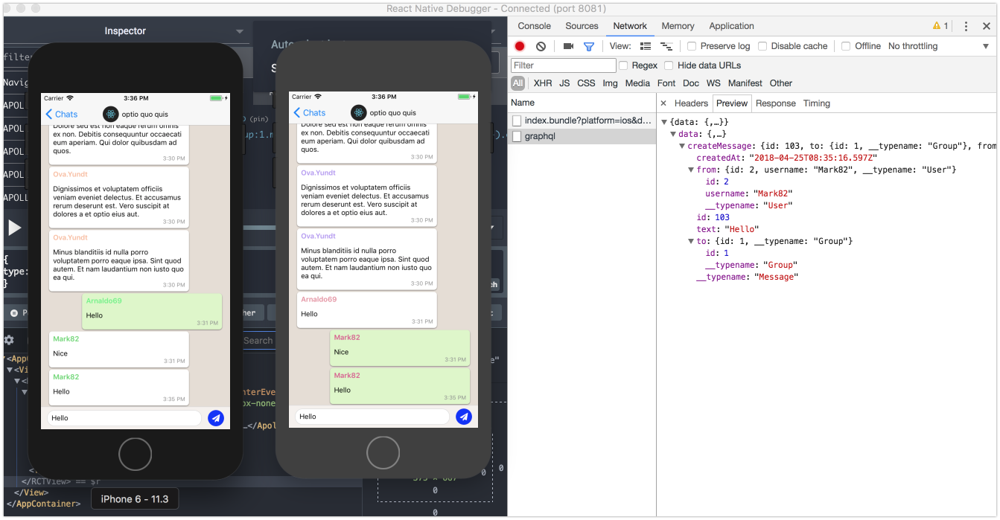

# Chatty

## A WhatsApp clone with React Native and Apollo, Sequelize, Sagas, React Navigation, Redux Persist

# Installing

```
yarn                               # install server dependencies
cd client && yarn                  # install client dependencies
```

For Steps 7 and higher, please enter your configuration variables in `.env`:

```
# use your own secret!!!
JWT_SECRET=your_secret
```

# Getting Started

```
yarn start                          # start the server
cd client
URL=192.168.24.223 yarn start       # start client
react-native run-ios                # start RN client
```

# Demo


